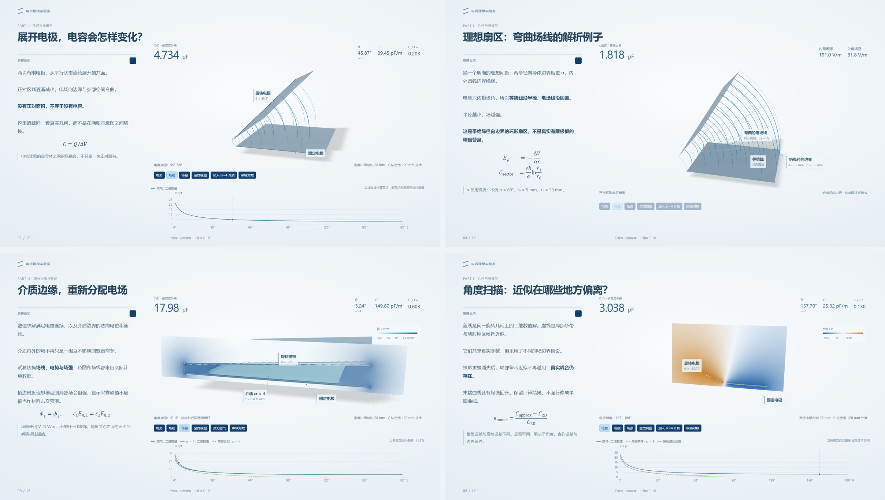

# Scientific Demos

电容、电场与触觉感知的交互式科学演示合集。两个辅助作品放在同一个入口，各自保留源码、数据与模型说明。

**[在线合集](https://lix-works.github.io/scientific-demos/)** · [ProxiTouch](https://lix-works.github.io/scientific-demos/proxitouch/) · [互电容建模实验室](https://lix-works.github.io/scientific-demos/mutual-capacitance/)

| 演示 | 内容 | 入口 |
| --- | --- | --- |
| **ProxiTouch** | 23 场景：电容传感、离子界面、共享电极与连续感知概念设计 | [项目介绍](projects/proxitouch/README.md) · [场景预览](projects/proxitouch/previews/overview.png) |
| **互电容建模实验室** | 12 场景：有限电极旋转、解析近似、BEM 数据、有限介质与数值检查 | [项目介绍](projects/mutual-capacitance/README.md) · [场景预览](projects/mutual-capacitance/previews/overview.png) |




两个概览均为精选的 2×2 拼图，完整图库保留每个项目的 12 张实际截图。ProxiTouch 展示离子机理、接触面积、双通道交互和应用；互电容展示展开几何、理想扇区、介质边缘场和定量模型比较。

## 运行与修改

使用 Node.js 22 或更新版本，在本仓库根目录运行：

```sh
npm run build
npm run check
npm test
npm run preview
```

打开终端打印的本地地址。构建使用包内 TypeScript 5.8.3，无需联网安装。构建后，`index.html` 是离线合集入口；两个演示的 `projects/<name>/index.html` 也可直接打开，需要 WebGL2 浏览器。

合集首页在 `web/`，演示源代码在 `projects/<name>/source/src/`。修改源码后重新构建，不单独编辑打包 HTML。

## 验证与部署

浏览器检查与预览刷新需要 Python 3.12、Playwright 和 Pillow：

```sh
python -m pip install -r requirements-qa.txt
python -m playwright install chromium
npm run qa
npm run previews
npm run build
npm test
```

`qa` 检查真实 HTTP、仓库子路径、35 个场景及关键交互；预览命令重新渲染实际应用，不以旧图片代替当前验证。科学重算另见各项目文档，运行网页不需要 Python 求解服务。

单个 [GitHub Pages 工作流](.github/workflows/pages.yml) 构建两个项目，仅发布根 `site/`。设置与上传范围见 [DEPLOY.md](DEPLOY.md)；构建与发布结果可在仓库 Actions 页面查看。

可选科学抽验使用互电容项目的 `requirements-reproduce.txt`，运行 `npm run test:science`。它只复算 8 个 BEM 工况并核对单位、编码和几何，不覆盖已发布数据，也不代表完整重算。`npm run test:safety` 用标准库测试失败阶段不会覆盖既有成果，无需科学依赖。

## 模型范围与授权

ProxiTouch 是未制造、未实测的概念设计。互电容展示真实尺寸参数下的预计算数值与节点插值；二维宽度外推、局部近似和有限宽度三维检查各有适用范围。功能回归不等于实验验证。

原创源码、图文和数据采用 [MIT](LICENSE)，允许修改与商业复用；第三方组件保留各自授权，详见 [许可声明](THIRD_PARTY_NOTICES.md)。历史上传基线与既有科学证据保留在各项目 `reference/`、`archive/`。当前修复和验证见 [CHANGELOG.md](CHANGELOG.md) 与 [QA_REPORT.md](QA_REPORT.md)。
