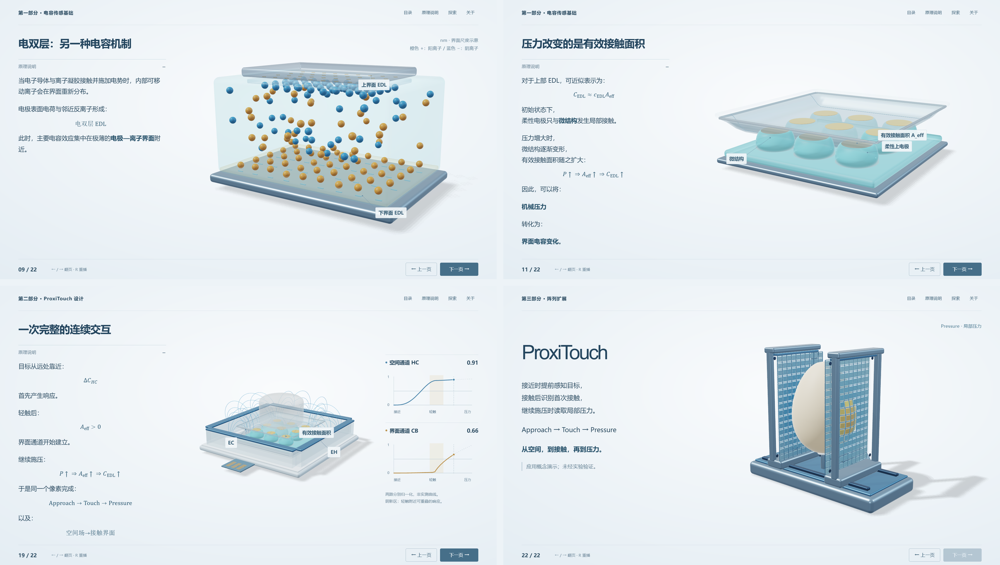

# ProxiTouch

电容传感基础、离子界面与共享中央电极的连续感知概念设计。共 23 个场景，是 [Scientific Demos 合集](../../README.md) 的一个独立演示。



## 打开与构建

合集本地入口是根目录 `index.html`，或者运行根目录 `npm run preview`。本项目生成的 `index.html` 也可直接离线打开；浏览器需要 WebGL2。

在本项目目录使用 Node.js 22 或更新版本：

```sh
npm run build:offline
npm run check
npm test
```

离线构建使用附带的 TypeScript 5.8.3。联网安装可用 `npm --prefix source ci`，锁文件已提供。源码在 `source/src/`、样式在 `source/public/`；构建重新生成 `dist/`、`index.html`、项目 `site/`。合集工作流再汇总为根 `site/proxitouch/`。

## 当前修复与保留内容

原上传基准 `reference/final-upload.html` 保持原字节。科学参数和预计算数据保留；交互与工程修复通过 [发布约束](docs/RELEASE_CONTRACT.json) 记录到精确模块哈希，既有基准不被新输出替换。修复清单与验收见 [合集 CHANGELOG](../../CHANGELOG.md)、[合集 QA](../../QA_REPORT.md)。

`npm test` 检查发布约束、科学输入与 proxi-regressions.mjs 中的行为回归。浏览器验收从合集根目录运行 `npm run qa`，覆盖 HTTP、仓库子路径和离线文件。预览刷新使用根 `npm run previews`。

## 模型范围

ProxiTouch 尚未制造或实测。离子、微穹顶及信号用于概念解释；二维数值场在三维切片中展示，不是完整器件的三维有限元验证。详见 [物理说明](docs/PHYSICS_README.md)。

## 档案与许可

历史报告和旧测试在 `archive/`、`source/legacy-tests/`；原先独立仓库的部署交接保存在 `archive/prior-github-handoff/`。历史结论不自动代表本次验收。

原创源码、图文和数据使用 [MIT](LICENSE)；KaTeX 和 TypeScript 保留第三方许可。独立 HTML 和发布目录带有必要通知。发布统一由 [合集工作流](../../.github/workflows/pages.yml) 处理。
